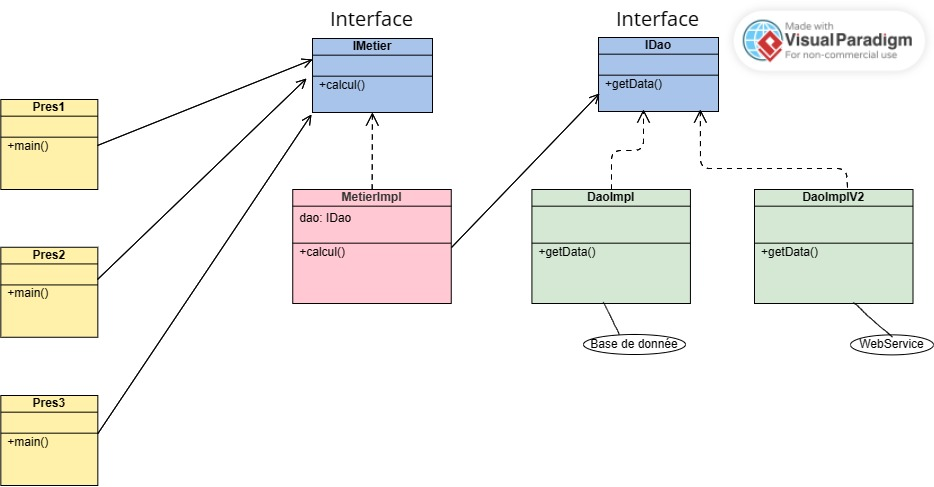
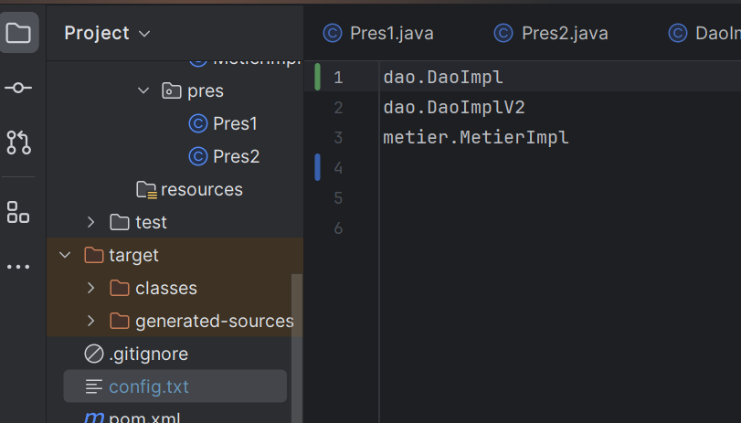
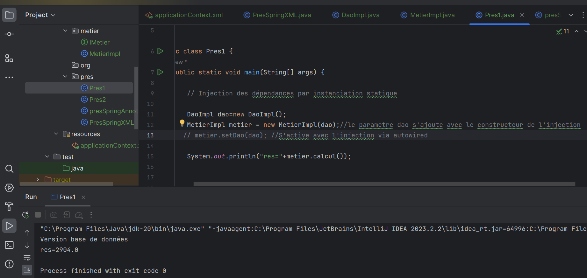
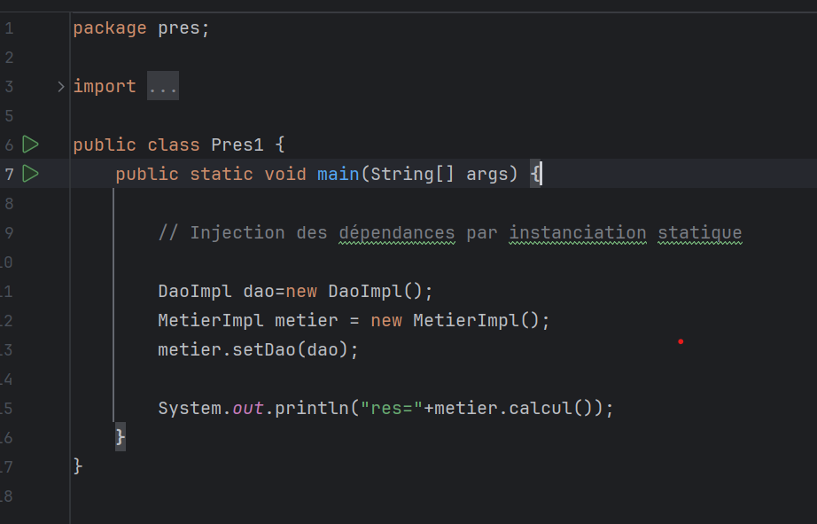
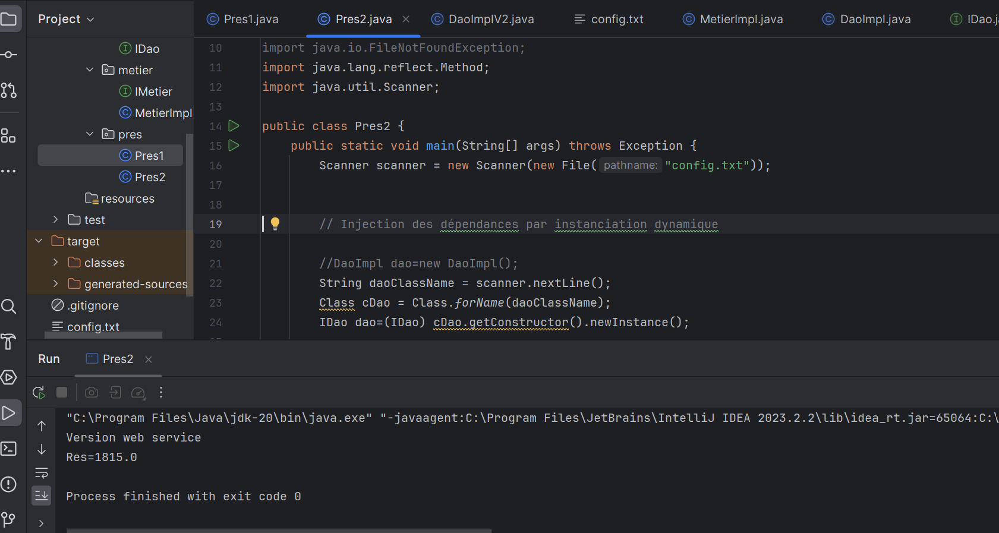
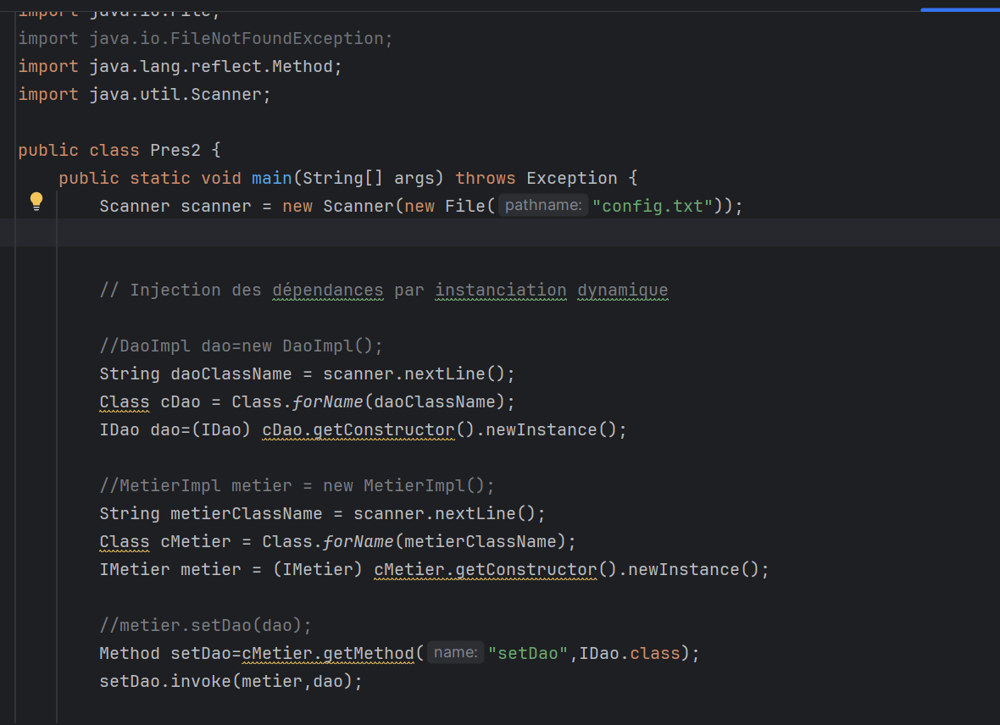
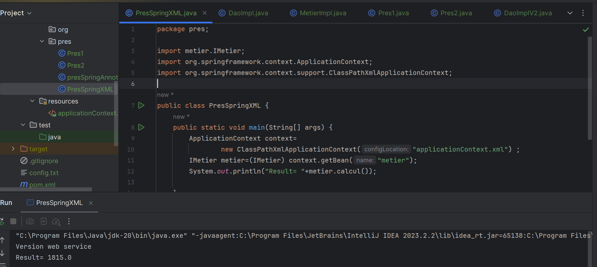
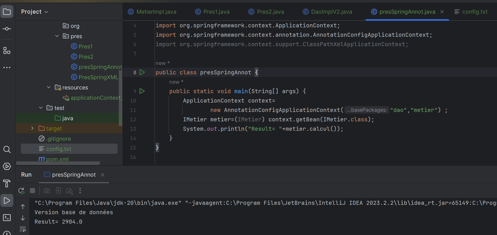
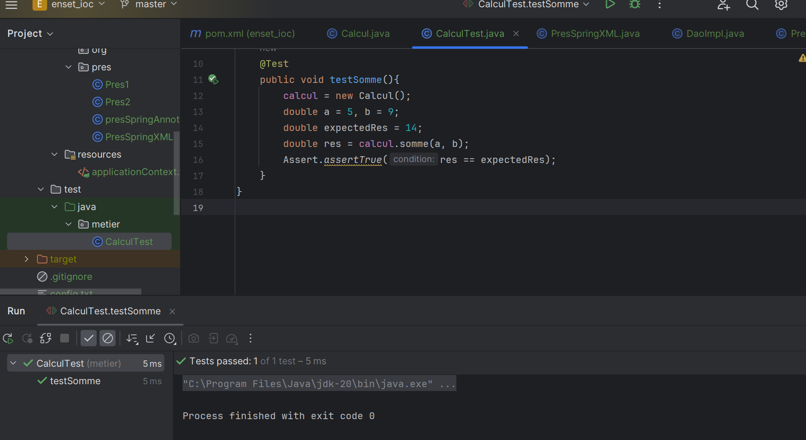

Realisée par : Nisrine AOMARI

<h1 >Compte Rendu de l'inversion de contrôle et l'injection des dépendances</h1>
<h2 style="color: hotpink">Introduction</h2>

L'inversion de contrôle (IoC) représente un concept clé dans le domaine du développement 
logiciel, offrant la possibilité de gérer les dépendances d'un objet sans la nécessité de 
les instancier directement. Dans ce contexte, Spring, en tant que framework de développement Java,
intervient lors de la création des objets pour injecter les dépendances entre les différents
composants, communément appelés "Beans". Cette intervention garantit l'établissement de toutes 
les relations nécessaires entre les composants.

Cette approche permet aux développeurs de se focaliser pleinement sur la logique métier de
leur application. En effet, Spring prend en charge l'injection des dépendances, libérant ainsi 
les développeurs des préoccupations liées à l'initialisation des objets. De plus, Spring offre 
une panoplie de fonctionnalités techniques qui simplifient la gestion des composants, permettant
aux professionnels de se concentrer sur la création d'une application robuste et efficace.

<h2 style="color: hotpink">Ennoncé</h2>
<ol>
    <li>Couche DAO 
        <ul>
            <li>créer l'interface IDao</li>
            <li>créer une implémentation de l'interface IDao</li>
        </ul>
    </li>
    <li>Couche Métier
        <ul>
            <li>créer l'interface IMetier</li>
            <li>créer une implémentation de l'interface IMetier</li>
        </ul>
    </li>
    <li>Couche Présentation
        
Créer une application qui permet de faire l'injection des dépandences

        <ul>
        <li>Instantiation statique</li>
        <li>Instantiation dynamique</li>
        <li>En utilisant Spring Framework
            <ul>
                <li>version XML</li>
                <li>version Annotation</li>
            </ul>
        </li>
        </ul>
    </li>
</ol>
<h2 style="color: hotpink">Conception</h2>
<h3>Principe du couplage faible</h3>

Lorsque nous visons à atteindre un couplage faible, l'utilisation d'interfaces est un élément essentiel. 
Pour illustrer cela, prenons en considération deux classes : `DaoImpl`, qui implémente l'interface `IDao`, 
et `MetierImpl`, qui implémente l'interface `IMetier`.

Lorsque la classe `MetierImpl` est associée à l'interface `IDao`, on peut dire que la classe
`MetierImpl` et la classe `IDaoImpl` sont liées par un couplage faible.

Cela implique que la classe `MetierImpl` peut collaborer avec n'importe quelle classe qui respecte le contrat 
défini par l'interface `IDao`. En réalité, la classe `MetierImpl` n'a conscience que de l'existence 
de cette interface, ce qui signifie qu'elle peut être associée à n'importe quelle classe qui implémente 
cette interface, et ce, sans nécessiter de modifications dans la classe `MetierImpl`.

Le couplage faible permet ainsi de créer des applications qui sont résistantes aux modifications
internes tout en étant flexibles pour les extensions.

<h2 style="color: hotpink">Captures d'écrans</h2>

<h3>Fichier Config:</h3>

<h3>Execution de pres1 (Version BD) :</h3>

<h3>Instanciation Statique :</h3>

<h3>Execution de pres2 (Version WS) :</h3>

<h3>Instanciation Dynamique :</h3>

<h3>Execution version Spring_XML :</h3>

<h3>Execution Version Annotations : </h3>
</h3>

<h3>Class de Test :</h3>

<h2 style="color: hotpink">Conclusion</h2>

Dans cette étude, nous avons exploré l'essence de l'Inversion de 
Contrôle (IoC) et de
l'Injection de Dépendances (DI) dans le contexte du framework Spring.
Grâce à ces concepts, les développeurs peuvent déléguer la gestion des objets et de leurs relations à Spring, libérant ainsi leur énergie pour se concentrer sur l'essence même de leur 
application. L'IoC et la DI avec Spring offrent un moyen puissant
d'optimiser la flexibilité, la modularité et la maintenance des applications, contribuant ainsi à l'évolution constante du développement logiciel.
